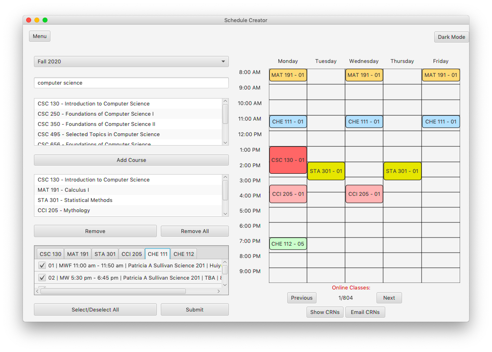
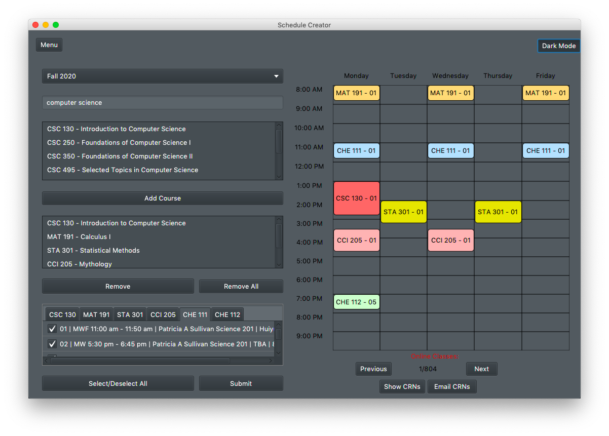

## University Course Scheduler

This project is an interactive visual course scheduler specifically for students at UNC Greensboro. It allows students too quickly and efficiently pick a personally optimized and conflict free schedule for courses, and allows for simpler registration for those courses

## Objective

- **The main objective of this project is to make schedule selection and registration of courses much faster and simpler for students through visualization.**

## Features

- All possible conflict-free schedules of sections from a pool of courses the user has selected can be seen in a weekly calendar

  
  <b>Note: There are 804 possible schedules with the  6 currently selected courses</b> 

- Database of courses for new semesters can be updatable by the user
- Registration codes for courses can be emailed to the user
- Built-in web browser that directly goes to the university registration website
- Dark mode option

## Documentation
    > Wire Frame
    > System Requirements Document
    > MVC Architecture Diagram
    > Use Case Diagram and Scenarios
    > UML Diagram

### About
This project was made in a team of 4 over the course of 3 months in a software engineering course. It implements things such as event-driven architecture, MVC framework, email REST API, persistent storage, and was made using the agile method, just to name a few. Documentation as can be seen above includes the most common software documentation pertaining to requirements and architecture/design along with other technical documents. 
### Authors
- [@xsfar](https://github.com/xsfar) , [@jamisonv93](https://github.com/jamisonv93), [@toldge](https://github.com/toldge), [@wrycode](https://github.com/wrycode)

